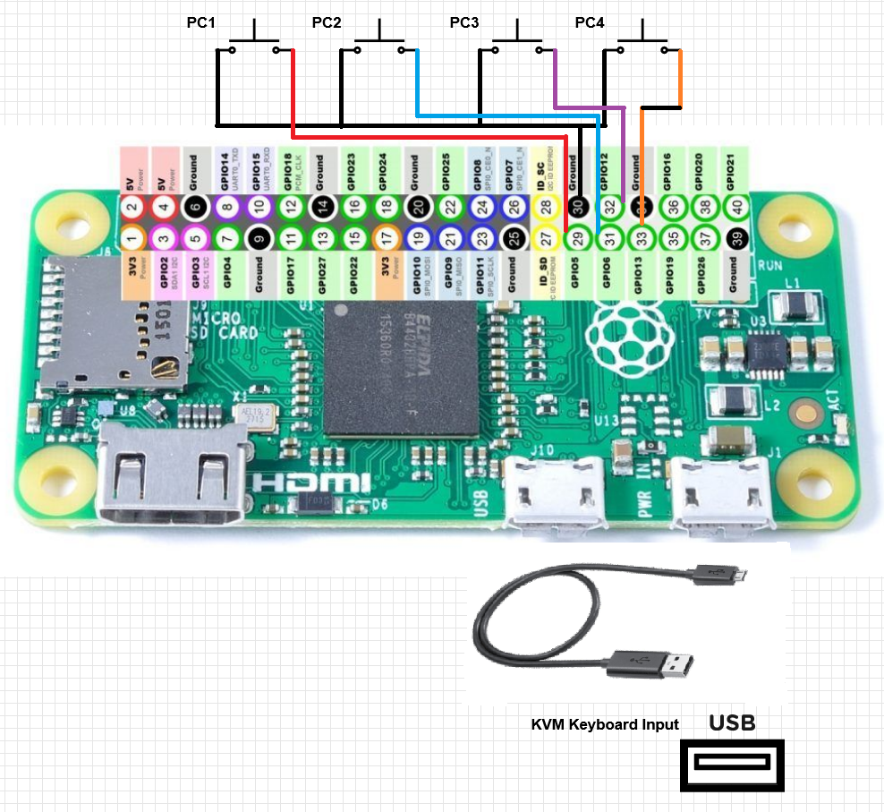

# KVM Switcher Pi
Wired, physical switch (button) control for a KVM that does not have any control beyond keyboard hotkey combinations (e.g. scroll-lock twice + number key).

## Overview
Using the [Raspberry Pi Zero](https://www.raspberrypi.org/products/raspberry-pi-zero/), the lowest cost, USB [Human Interface Device (aka HID)](https://en.wikipedia.org/wiki/USB_human_interface_device_class) emulation in the Pi lineup, a shell script on startup creates the necessary HID keyboard interface on boot (```/dev/hidg0```).  Next the python controller.py is launched, which setups callback listeners to our Pi GPIO pins (29, 31, 33, 35) for button presses, then goes into a permanently signal interrupt loop.  Upon a button press, the ``SwitchKVM()`` function is called with our button, which is mapped to sending the corresponding key sequence to our virtual keyboard (Scroll-Lock + Scroll-Lock + 1-4).



## Hardware
* [Raspberry Pi Zero](https://www.raspberrypi.org/products/raspberry-pi-zero/)
* [TESmart 4x1 KVM 4K@60Hz](https://www.tesmart.com/collections/hdmi-kvm/products/tesmart-4x1-hdmi-kvm-switch-4k-60hz-ultra-hd-mechanical-multimedia-keyboards-usb-2-0-devices-audio-output-4-in-1-out-hdmi-kvm-switcher-with-2-pcs-5ft-kvm-cables-4-port-kvm-control-up-to-4-computers-servers-dvr#)
* [Project box](https://www.amazon.com/Raculety-Waterproof-Electrical-Electronic-100x68x50mm/dp/B089JYDRLK/ref=sr_1_7?dchild=1&keywords=project%2Bbox%2Bundermount&qid=1620576900&sr=8-7&th=1) with mount wings for under-desk mounting
* Micro USB cable - this will both power our Pi Zero and be the USB client for our keyboard
* Momentary push buttons and wire